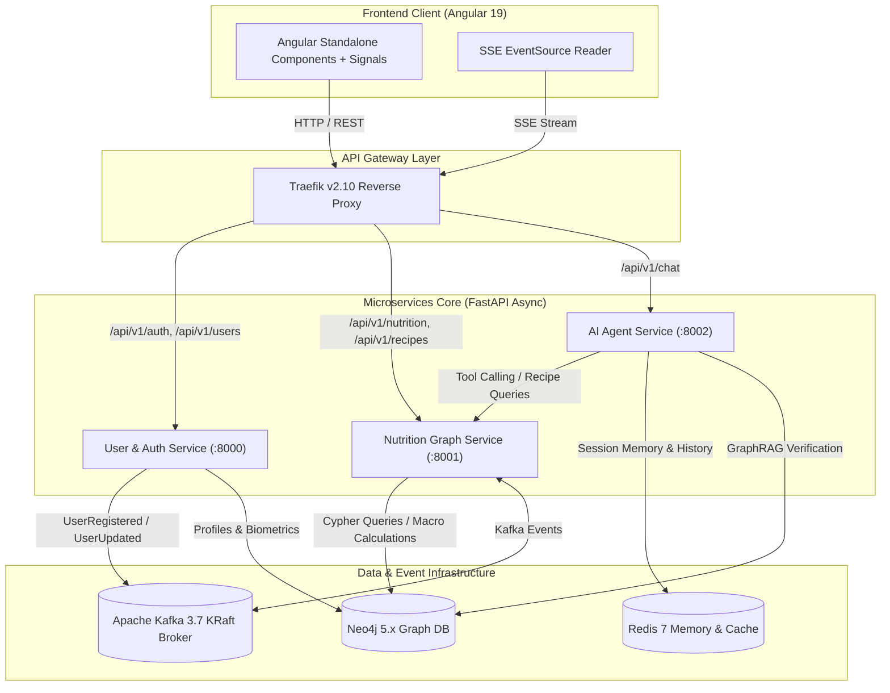

# 🥗 NutriGraph AI

> **Plataforma Enterprise de Recomendación Nutricional Conversacional & GraphRAG Determinista**
> 
> *NutriGraph AI combina microservicios asíncronos en Python (FastAPI), bases de datos de grafos (Neo4j), mensajería event-driven en tiempo real (Apache Kafka KRaft), memoria conversacional distribuida (Redis), Server-Sent Events (SSE) y un cliente web reactivo en Angular.*

---

[](https://www.python.org/)
[](https://fastapi.tiangolo.com/)
[](https://angular.dev/)
[](https://neo4j.com/)
[-231F20?style=for-the-badge&logo=apachekafka&logoColor=white)](https://kafka.apache.org/)
[](https://redis.io/)
[](https://traefik.io/)
[](https://www.docker.com/)
[](https://kubernetes.io/)

---

## 📑 Tabla de Contenidos
- [🎯 Visión General](#-visión-general)
- [🛡️ Seguridad Alimentaria Determinista](#️-seguridad-alimentaria-determinista)
- [🏗️ Arquitectura del Sistema](#️-arquitectura-del-sistema)
- [💻 Stack Tecnológico](#-stack-tecnológico)
- [🧩 Descripción de Microservicios](#-descripción-de-microservicios)
- [⚡ Event-Driven Architecture (Kafka)](#-event-driven-architecture-kafka)
- [🚀 Guía de Instalación y Entorno Local](#-guía-de-instalación-y-entorno-local)
- [☸️ Orquestación Declarativa en Kubernetes](#️-orquestación-declarativa-en-kubernetes)
- [🧪 Pruebas y Calidad de Código](#-pruebas-y-calidad-de-código)
- [🔄 CI/CD Pipeline](#-cicd-pipeline)

---

## 🎯 Visión General

**NutriGraph AI** es una solución integral diseñada para ofrecer orientación nutricional hiperpersonalizada. A diferencia de los sistemas conversacionales tradicionales basados puramente en LLMs —que pueden sufrir de alucinaciones críticas al tratar con alergias o intolerancias alimentarias— NutriGraph AI implementa un modelo **GraphRAG (Graph Retrieval-Augmented Generation)** donde la base de conocimiento nutricional reside en un grafo de conocimiento estricto (Neo4j).

### Principales Capacidades
- **Onboarding Biométrico Preciso**: Cálculo automatizado de IMC (Índice de Masa Corporal), TMB (Tasa Metabólica Basal mediante Mifflin-St Jeor) y GETD (Gasto Energético Total Diario según nivel de actividad).
- **Gestión Estricta de Restricciones Alimentarias**: Filtrado matemático y lógico de alérgenos e intolerancias (e.g., celiaquía, intolerancia a la lactosa, dieta vegana/keto).
- **Asistente Inteligente con Tool Calling**: Un agente LLM capaz de consultar el grafo en tiempo real mediante herramientas de recomendación y responder vía **Server-Sent Events (SSE)** token por token.
- **Arquitectura Event-Driven y Escalable**: Desacoplamiento total mediante eventos en Apache Kafka y microservicios independientes listos para despliegue en Kubernetes.

---

## 🛡️ Seguridad Alimentaria Determinista

En la industria de la salud y nutrición, delegar el filtrado de alérgenos a la inferencia de un modelo probabilístico es un riesgo inaceptable. Por ello, NutriGraph AI aplica el principio de **Seguridad Determinista**:

$$\text{Filtro de Alérgenos} = \text{Traversals Cypher en Neo4j} \quad \Rightarrow \quad 0\% \text{ Alucinaciones}$$

1. **El LLM no decide qué alimentos son seguros.** El LLM únicamente formula la consulta o invoca herramientas.
2. **El Grafo valida las restricciones.** Las consultas Cypher aplican condiciones explícitas (`WHERE NONE(...)`) recorriendo los caminos entre `:User`, `:Allergen`, `:Ingredient` y `:Recipe`.
3. **El Agente sintetiza la respuesta.** El LLM recibe únicamente la lista de ingredientes y recetas *garantizadas como seguras* por el motor de grafos.

---

## 🏗️ Arquitectura del Sistema

El sistema utiliza una arquitectura monorepo de microservicios coordinados por un **API Gateway (Traefik)** que sirve como punto único de entrada para la aplicación frontend en Angular.



---

## 💻 Stack Tecnológico

### Backend Microservices
- **Python 3.11+**: Programación asíncrona nativa (`async`/`await`).
- **FastAPI**: Framework de alto rendimiento para APIs REST y streaming SSE.
- **Pydantic V2 & pydantic-settings**: Validación estricta de esquemas de datos y configuración tipada por variables de entorno.
- **PyJWT & Passlib/Bcrypt**: Autenticación segura basada en tokens JWT y hashing de contraseñas.
- **aiokafka**: Cliente asíncrono para producción y consumo de mensajes en Kafka.

### Bases de Datos y Caché
- **Neo4j 5.x (Labeled Property Graph)**: Almacenamiento de relaciones complejas entre usuarios, alérgenos, ingredientes, nutrientes y recetas con soporte de procedimientos APOC.
- **Redis 7**: Memoria conversacional por sesión para el agente de IA y caché distribuida de consultas de alto tráfico.

### Event Streaming & Governance
- **Apache Kafka 3.7 (Modo KRaft)**: Broker de eventos en tiempo real sin dependencia de Zookeeper.
- **Traefik v2.10**: Reverse proxy y API Gateway con balanceo de carga, rate limiting y reglas CORS centralizadas.
- **HashiCorp Consul**: Service discovery y registro de instancias dinámico.

### AI & GraphRAG
- **LangChain / LlamaIndex**: Orquestación del flujo de agente conversacional con Tool Calling explícito.
- **SSE (Server-Sent Events)**: Transmisión en tiempo real de tokens de respuesta al cliente.

### Frontend
- **Angular 19+**: Componentes independientes (Standalone Components), Angular Signals para gestión reactiva de estado y RxJS.
- **Vanilla CSS / Modern Design Tokens**: Interfaz oscura premium con micro-animaciones y renderizado reactivo del chat.

### DevOps & CI/CD
- **Docker & Docker Compose**: Empaquetado multi-stage optimizado para cada microservicio.
- **Kubernetes (K8s)**: Manifiestos organizados en 5 capas declarativas fásicas.
- **GitHub Actions**: Automatización de pruebas unitarias/integración (CI) y compilación/despliegue de imágenes (CD).

---

## 🧩 Descripción de Microservicios

### 1. `user-auth-service`
- **Puerto interno**: `8000` | **Ruta Gateway**: `/api/v1/auth`, `/api/v1/users`
- **Responsabilidades**:
  - Registro de usuarios, inicio de sesión e emisión de JWT.
  - Gestión del perfil biométrico (edad, sexo, peso, altura, nivel de actividad).
  - Cálculo de métricas de salud (IMC, TMB, GETD).
  - Registro de intolerancias alimentarias y preferencias dietéticas.
  - Publicación de eventos en Kafka (`UserRegistered`, `UserIntolerancesUpdated`).

### 2. `nutrition-graph-service`
- **Puerto interno**: `8000` (mapeado a `8001` en dev) | **Ruta Gateway**: `/api/v1/nutrition`, `/api/v1/recipes`
- **Responsabilidades**:
  - Gestión del grafo de conocimiento nutricional en Neo4j.
  - Modelado de nodos (`:User`, `:Recipe`, `:Ingredient`, `:Nutrient`, `:Allergen`, `:DietType`).
  - Cálculo dinámico de macronutrientes (calorías, proteínas, grasas, carbohidratos) basados en las relaciones `:CONTAINS_INGREDIENT`.
  - Consultas Cypher optimizadas para la recomendación segura de recetas filtrando alérgenos.

### 3. `ai-agent-service`
- **Puerto interno**: `8000` (mapeado a `8002` en dev) | **Ruta Gateway**: `/api/v1/chat`
- **Responsabilidades**:
  - Orquestación del Agente de Inteligencia Artificial mediante GraphRAG.
  - Invocación de herramientas (Tool Calling) contra `nutrition-graph-service`.
  - Gestión de la conversación y contexto del usuario mediante Redis.
  - Streaming de respuestas token por token utilizando Server-Sent Events (SSE).

### 4. `frontend` (Angular Web Client)
- **Puerto dev**: `4200`
- **Responsabilidades**:
  - Flujo de onboarding intuitivo con cálculo de métricas en tiempo real.
  - Dashboard de usuario con visualización de perfil nutricional.
  - Chat conversacional fluido reactivo a eventos SSE.

---

## ⚡ Event-Driven Architecture (Kafka)

Los microservicios se comunican asíncronamente a través de Apache Kafka para mantener un desacoplamiento estricto:

| Tópico Kafka | Productor | Consumidores | Propósito |
| :--- | :--- | :--- | :--- |
| `user.events.registered` | `user-auth-service` | `nutrition-graph-service` | Crea el nodo `:User` correspondiente en el grafo Neo4j. |
| `user.events.intolerances-updated` | `user-auth-service` | `nutrition-graph-service` | Actualiza las relaciones `:HAS_ALLERGEN` entre el usuario y los alérgenos. |
| `nutrition.events.recipe-created` | `nutrition-graph-service` | `ai-agent-service` | Invalida cachés de recomendaciones en Redis. |

---

## 🚀 Guía de Instalación y Entorno Local

### Requisitos Previos
- **Docker Desktop** (con soporte para Docker Compose V2).
- **Python 3.11+** (para desarrollo individual de microservicios).
- **Node.js 20+** & **npm** (para desarrollo frontend).

### 1. Clonar el Repositorio
```bash
git clone https://github.com/tu-usuario/NutriGraph_AI.git
cd NutriGraph_AI
```

### 2. Configurar Variables de Entorno
Copia el archivo de ejemplo y ajusta las credenciales necesarias:
```bash
cp .env.example .env
```

### 3. Levantar la Infraestructura Completa con Docker Compose
```bash
docker-compose up -d --build
```

### 4. Verificar Servicios
Una vez iniciados los contenedores, los siguientes paneles y servicios estarán disponibles:

- 🌐 **Frontend App (Angular)**: [http://localhost:4200](http://localhost:4200)
- 🔀 **Traefik Dashboard**: [http://localhost:8080](http://localhost:8080)
- 📊 **Neo4j Browser**: [http://localhost:7474](http://localhost:7474) (Usuario: `neo4j`, Password: según `.env`)
- 📄 **User & Auth Swagger**: `http://localhost:8000/docs`
- 📄 **Nutrition Graph Swagger**: `http://localhost:8001/docs`
- 📄 **AI Agent Swagger**: `http://localhost:8002/docs`

---

## ☸️ Orquestación Declarativa en Kubernetes

El proyecto sigue una estructura estricta dividida en 5 fases numeradas dentro del directorio `k8s/`, respetando la separación entre configuración, infraestructura, core y servicios:

```
k8s/
├── 01-config/      # ConfigMaps y Secrets (datos sensibles y variables de entorno)
├── 02-infra/       # Bases de datos y brokers (Neo4j, Kafka KRaft, Redis)
├── 03-core/        # Service Discovery y componentes base (Consul)
├── 04-services/    # Microservicios de negocio FastAPI y API Gateway (Traefik)
└── 05-frontend/    # Cliente web Angular
```

### Despliegue en Clúster (minikube / K8s)
Para aplicar todos los manifiestos en orden secuencial:

```bash
kubectl apply -f k8s/01-config/
kubectl apply -f k8s/02-infra/
kubectl apply -f k8s/03-core/
kubectl apply -f k8s/04-services/
kubectl apply -f k8s/05-frontend/
```

---

## 🧪 Pruebas y Calidad de Código

### Backend (Python / FastAPI)
Cada microservicio cuenta con su propia suite de pruebas unitarias e integración con `pytest`:

```bash
# Ejemplo: Pruebas unitarias de User & Auth Service
cd services/user-auth-service
pytest -v

# Ejemplo: Pruebas con coberturas y mocks de Kafka/Neo4j
pytest --cov=app tests/
```

### Frontend (Angular)
```bash
cd frontend/angular-app
npm test
```

---

## 🔄 CI/CD Pipeline

El repositorio cuenta con workflows automatizados en **GitHub Actions**:

- 🧪 **CI Workflow (`.github/workflows/ci.yml`)**: Se ejecuta en cada Pull Request a `main`. Realiza análisis estático de código, linter (`ruff`), verificación de tipos y ejecución de la suite completa de pruebas.
- 🚀 **CD Workflow (`.github/workflows/cd.yml`)**: Se dispara tras hacer merge a `main`. Compila las imágenes Docker multi-stage para cada microservicio y las publica en el Container Registry.

---

## 📜 Licencia y Contacto

Desarrollado como proyecto de alta precisión técnica combinando inteligencia artificial conversacional y bases de datos de grafos. 

Distribuido bajo la Licencia MIT. ¡Siente libre de contribuir o abrir un issue!
